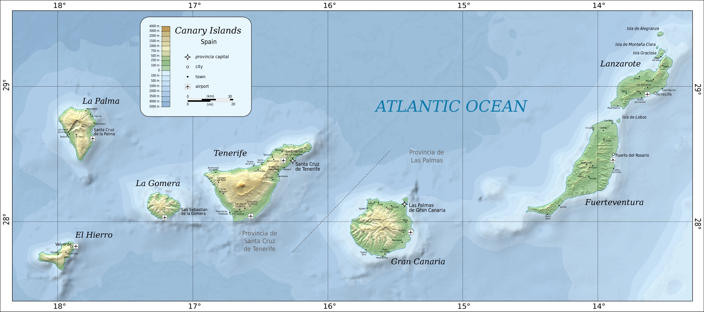

# La Palma

La Palma is the northwesternmost island of the Canarian archiepelago and home to the World's largest optical-infrared telescope - the Gran Telescopio Canarias or GTC.  The highest point on the island, the Roque de los Muchachos observatory (operated by the Instituto de Astrofísica de Canarias), enjoys exceptional observing conditions and is host to a number of other important international astronomical facilities.

## School location

The school will be held at the Instituto de Astrofísica de Canarias' offices on La Palma, known as the Center for Astrophysics on La Palma or CALP.  The CALP is in the small village of San Antonio on the eastern side of the island, approximately 10 minutes from the airport and from the island's capital, Santa Cruz de La Palma.  A free bus will operate to take attendees from the popular resort town of Los Cancajos to and from the CALP during the school.

## Accommodation

La Palma is a popular tourist destination, offering numerous accommodation options including hotels, aparthotels and airbnbs.  The accommodation options in San Antonio (where the school will be held), so attendees are encouraged to search for accommodation in Los Cancajos (from which there will be a free bus to take attendees to and from the school) or Santa Cruz de La Palma (the island's capital, a ten-minute public bus ride from San Antonio and a few minute bus ride from Los Cancajos).

## Travel

Daily direct flights from the Spanish capital, Madrid, run with Iberia.  There are roughly weekly connections is several other major [European cities](https://www.aena.es/en/la-palma/airlines-and-destinations/airport-destinations.html), including London, Berlin, Munich, Brussels, Amsterdam and Zurich.

## Weather

In September, La Palma is generally warm and clear, with temperatures ranging from 20-30C.  However, due to its sub-tropical island climate, heavy rains and/or storms are not unheard of.  At the Roque de los Muchachos Observatory, the temperature can be significantly lower even in the Summer months.  So, those attendees wishing to join for the observatory visit should come prepared with appropriate clothes (and footwear).
