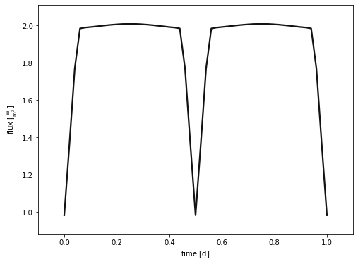
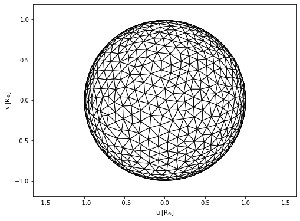
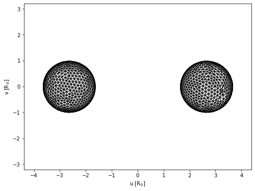
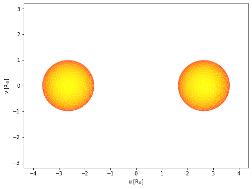

```python
import phoebe
from phoebe import u,c
import matplotlib.cm as cm
logger = phoebe.logger(clevel='WARNING')
```

Phoebe is capable of building all kinds of heirarchies, but the simplest way to begin is by loading the default binary and then changing its parameters as we wish


```python
b = phoebe.default_binary()
```

This object is known as a 'bundle' and contains all the parameters of the system as well as some callable methods.


```python
b
```


    <PHOEBE Bundle: 141 parameters | contexts: component, system, constraint, setting, figure, compute>


Let's investigate parameters related to compute contained in the bundle


```python
print(b['compute'])
```

    ParameterSet: 17 parameters
         sample_from@phoebe01@compute: []
            comments@phoebe01@compute: 
          use_server@phoebe01@compute: none
       dynamics_method@phoebe01@co...: keplerian
                ltte@phoebe01@compute: False
        irrad_method@phoebe01@compute: horvat
       boosting_method@phoebe01@co...: none
       eclipse_method@phoebe01@com...: native
       horizon_method@phoebe01@com...: boolean
       mesh_method@primary@phoebe0...: marching
       mesh_method@secondary@phoeb...: marching
       ntriangles@primary@phoebe01...: 1500
       ntriangles@secondary@phoebe...: 1500
       distortion_method@primary@p...: roche
       distortion_method@secondary...: roche
         atm@primary@phoebe01@compute: ck2004
       atm@secondary@phoebe01@compute: ck2004


Can access these parameters through twigs (minimum string required to define a particular parameter) or filters


```python
b.filter(context='compute', component='primary', qualifier='ntriangles').get_parameter()
```


    <Parameter: ntriangles=1500 | keys: description, value, limits, visible_if, copy_for, readonly, advanced, latexfmt>


```python
b['ntriangles@primary@compute']
```


    <Parameter: ntriangles=1500 | keys: description, value, limits, visible_if, copy_for, readonly, advanced, latexfmt>


In the same way, we can set these parameters


```python
b['ntriangles@primary@compute']=200000
```


```python
b.filter(context='compute', component='primary', qualifier='ntriangles').set_value(1500)
```

Before we can actually run a model, we need to tell phoebe what to evaluate.  Is it a light curve? RV curve? Orbit? At what times? 
We do this by adding datasets (which can include the real data for comparison).


```python
b.add_dataset('lc', times=phoebe.linspace(0, 1, 51)*u.d, dataset='lc01',passband='Johnson:V')
```


    <ParameterSet: 80 parameters | contexts: constraint, figure, compute, dataset>


```python
b.run_compute()
b.plot(show=True)
```

    100%|██████████| 51/51 [00:01<00:00, 45.28it/s]


    

    


    (<autofig.figure.Figure | 1 axes | 1 call(s)>,
     <Figure size 576x432 with 1 Axes>)


Another example: meshes


```python
b.add_dataset('mesh', compute_times=[0,0.25], dataset='mesh01')
```


    <ParameterSet: 85 parameters | contexts: constraint, figure, compute, dataset>


```python
b.run_compute()
```

    Tue, 13 Sep 2022 13:00 BUNDLE       WARNING overwriting model: latest
    100%|██████████| 52/52 [00:01<00:00, 44.71it/s]


    <ParameterSet: 21 parameters | kinds: lc, mesh>


```python
b['mesh01@model'].plot(time=0,show=True)
```


    

    


    (<autofig.figure.Figure | 1 axes | 2 call(s)>,
     <Figure size 576x432 with 1 Axes>)


```python
b['mesh01@model'].plot(time=0.25,show=True)
```


    

    


    (<autofig.figure.Figure | 1 axes | 2 call(s)>,
     <Figure size 576x432 with 1 Axes>)


Meshes can even be plotted with face colours that represent temperature or intensity


```python
b.add_dataset('mesh', compute_times=[0.24], dataset='mesh02',columns=['visibilities', 'intensities@lc01'])
b.run_compute()
b['mesh02@model'].plot(fc='intensities@lc01', ec='None',fcmap=cm.autumn,show=True)
```

    Tue, 13 Sep 2022 13:01 BUNDLE       WARNING overwriting model: latest
    100%|██████████| 52/52 [00:01<00:00, 47.89it/s]


    

    


    (<autofig.figure.Figure | 1 axes | 2 call(s)>,
     <Figure size 576x432 with 1 Axes>)


```python

```
