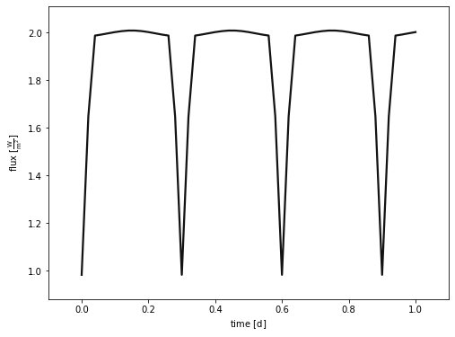

```python
import phoebe
from phoebe import u,c
import matplotlib.cm as cm
logger = phoebe.logger(clevel='WARNING')
```

Phoebe is capable of building all kinds of heirarchies, but the simplest way to begin is by loading the default binary and then changing its parameters as we wish


```python
b = phoebe.default_binary()
```

This object is known as a 'bundle' and contains all the parameters of the system as well as some callable methods.


```python
b
```


    <PHOEBE Bundle: 141 parameters | contexts: component, system, figure, compute, setting, constraint>


Let's investigate parameters related to compute contained in the bundle


```python
print(b['compute'])
```

    ParameterSet: 17 parameters
         sample_from@phoebe01@compute: []
            comments@phoebe01@compute: 
          use_server@phoebe01@compute: none
       dynamics_method@phoebe01@co...: keplerian
                ltte@phoebe01@compute: False
        irrad_method@phoebe01@compute: horvat
       boosting_method@phoebe01@co...: none
       eclipse_method@phoebe01@com...: native
       horizon_method@phoebe01@com...: boolean
       mesh_method@primary@phoebe0...: marching
       mesh_method@secondary@phoeb...: marching
       ntriangles@primary@phoebe01...: 1500
       ntriangles@secondary@phoebe...: 1500
       distortion_method@primary@p...: roche
       distortion_method@secondary...: roche
         atm@primary@phoebe01@compute: ck2004
       atm@secondary@phoebe01@compute: ck2004


Can access these parameters through twigs (minimum string required to define a particular parameter) or filters


```python
b.filter(context='compute', component='primary', qualifier='ntriangles').get_parameter()
```


    <Parameter: ntriangles=1500 | keys: description, value, limits, visible_if, copy_for, readonly, advanced, latexfmt>


```python
b['ntriangles@primary@compute']
```


    <Parameter: ntriangles=1500 | keys: description, value, limits, visible_if, copy_for, readonly, advanced, latexfmt>


In the same way, we can set these parameters


```python
b['ntriangles@primary@compute']=200000
```


```python
b.filter(context='compute', component='primary', qualifier='ntriangles').set_value(1500)
```

Before we can actually run a model, we need to tell phoebe what to evaluate.  Is it a light curve? RV curve? Orbit? At what times? 
We do this by adding datasets (which can include the real data for comparison).


```python
b.add_dataset('lc', times=phoebe.linspace(0, 1, 51)*u.d, dataset='lc01',passband='Johnson:V')
```


    <ParameterSet: 80 parameters | contexts: figure, dataset, constraint, compute>


```python
b.run_compute()
b.plot(show=True)
```

    100%|██████████| 51/51 [00:01<00:00, 48.51it/s]


    

    


    (<autofig.figure.Figure | 1 axes | 1 call(s)>,
     <Figure size 576x432 with 1 Axes>)


Another example: meshes


```python
b.add_dataset('mesh', compute_times=[0,0.25], dataset='mesh01')
```


    <ParameterSet: 85 parameters | contexts: figure, dataset, constraint, compute>


```python
b.run_compute()
```

    Fri, 16 Sep 2022 14:28 BUNDLE       WARNING overwriting model: latest
    100%|██████████| 52/52 [00:01<00:00, 43.64it/s]


    <ParameterSet: 21 parameters | kinds: lc, mesh>


```python
b['mesh01@model'].plot(time=0,show=True)
```


    

    


    (<autofig.figure.Figure | 1 axes | 2 call(s)>,
     <Figure size 576x432 with 1 Axes>)


```python
b['mesh01@model'].plot(time=0.25,show=True)
```


    

    


    (<autofig.figure.Figure | 1 axes | 2 call(s)>,
     <Figure size 576x432 with 1 Axes>)


Meshes can even be plotted with face colours that represent temperature or intensity


```python
b.add_dataset('mesh', compute_times=[0.24], dataset='mesh02',columns=['visibilities', 'intensities@lc01'])
b.run_compute()
b['mesh02@model'].plot(fc='intensities@lc01', ec='None',fcmap=cm.autumn,show=True)
```

    Fri, 16 Sep 2022 14:28 BUNDLE       WARNING overwriting model: latest
    100%|██████████| 52/52 [00:01<00:00, 46.57it/s]


    

    


    (<autofig.figure.Figure | 1 axes | 2 call(s)>,
     <Figure size 576x432 with 1 Axes>)


If we have time, you might want to play around with changing the parameters of the stars and/or orbit, in order to see what effect those changes have on the light curve. There are plenty to choose from!


```python
print(b['component'])
```

    ParameterSet: 62 parameters
             requiv@primary@component: 1.0 solRad
    C    requiv_max@primary@component: 2.013275176537638 solRad
               teff@primary@component: 6000.0 K
               abun@primary@component: 0.0
    C          logg@primary@component: 4.437551877570185
            syncpar@primary@component: 1.0
    C        period@primary@component: 1.0 d
    C          freq@primary@component: 6.283185 rad / d
              pitch@primary@component: 0.0 deg
                yaw@primary@component: 0.0 deg
    C          incl@primary@component: 90.0 deg
    C       long_an@primary@component: 0.0 deg
          gravb_bol@primary@component: 0.32
       irrad_frac_refl_bol@primary...: 0.6
    C  irrad_frac_lost_bol@primary...: 0.4
        ld_mode_bol@primary@component: lookup
        ld_func_bol@primary@component: logarithmic
       ld_coeffs_source_bol@primar...: auto
    C          mass@primary@component: 0.9988131358058301 solMass
           requiv@secondary@component: 1.0 solRad
    C  requiv_max@secondary@component: 2.013275176537638 solRad
             teff@secondary@component: 6000.0 K
             abun@secondary@component: 0.0
    C        logg@secondary@component: 4.437551877570185
          syncpar@secondary@component: 1.0
    C      period@secondary@component: 1.0 d
    C        freq@secondary@component: 6.283185 rad / d
            pitch@secondary@component: 0.0 deg
              yaw@secondary@component: 0.0 deg
    C        incl@secondary@component: 90.0 deg
    C     long_an@secondary@component: 0.0 deg
        gravb_bol@secondary@component: 0.32
       irrad_frac_refl_bol@seconda...: 0.6
    C  irrad_frac_lost_bol@seconda...: 0.4
       ld_mode_bol@secondary@compo...: lookup
       ld_func_bol@secondary@compo...: logarithmic
       ld_coeffs_source_bol@second...: auto
    C        mass@secondary@component: 0.9988131358058301 solMass
              period@binary@component: 1.0 d
    C           freq@binary@component: 6.283185 rad / d
                dpdt@binary@component: 0.0 s / yr
                per0@binary@component: 0.0 deg
              dperdt@binary@component: 0.0 deg / yr
                 ecc@binary@component: 0.0
    C     t0_perpass@binary@component: -0.25 d
          t0_supconj@binary@component: 0.0 d
    C         t0_ref@binary@component: 0.0 d
    C      mean_anom@binary@component: 89.99999559997653 deg
                incl@binary@component: 90.0 deg
                   q@binary@component: 1.0
                 sma@binary@component: 5.3 solRad
             long_an@binary@component: 0.0 deg
    C          asini@binary@component: 5.3 solRad
    C          ecosw@binary@component: 0.0
    C          esinw@binary@component: 0.0
    C      teffratio@binary@component: 1.0
    C    requivratio@binary@component: 1.0
    C  requivsumfrac@binary@component: 0.37735849056603776
    C           sma@primary@component: 2.65 solRad
    C         asini@primary@component: 2.65 solRad
    C         sma@secondary@component: 2.65 solRad
    C       asini@secondary@component: 2.65 solRad


```python
b['period@binary']=0.6*u.d
b.run_compute()
b['lc01@model'].plot(show=True)
```

    Fri, 16 Sep 2022 14:28 BUNDLE       WARNING overwriting model: latest
    100%|██████████| 52/52 [00:00<00:00, 57.61it/s]


    

    


    (<autofig.figure.Figure | 1 axes | 1 call(s)>,
     <Figure size 576x432 with 1 Axes>)


You will often run into issues with parameters going out of acceptable ranges. Also, remember that we are sampling the model light curve only at the time we defined earlier when adding the lc dataset - this can lead to artefacts in the plotted curve!


```python

```
