# PHOEBE for binary fitting #


```python
import numpy as np
import matplotlib.pyplot as plt
import phoebe
logger = phoebe.logger('WARNING')
%matplotlib inline
```

First we need to download the data that we will try to fit:
[lc.data](https://iacerasmus.github.io/ERASMUS2022/data/lc.data)
[rv2.data](https://iacerasmus.github.io/ERASMUS2022/data/rv1.data)
[rv2.data](https://iacerasmus.github.io/ERASMUS2022/data/rv2.data)

Now load the phoebe default binary and add those datasets to the bundle


```python
b = phoebe.default_binary()
lc_times, lc_fluxes, lc_errs = np.loadtxt('lc.data',unpack=True)
rv1_times, rv1_rvs, rv1_errs = np.loadtxt('rv1.data',unpack=True)
rv2_times, rv2_rvs, rv2_errs = np.loadtxt('rv2.data',unpack=True)

b.add_dataset('lc', times = lc_times, fluxes=lc_fluxes, sigmas=lc_errs, passband='Johnson:V')
b.add_dataset('rv')
b['times@rv@primary'], b['rvs@rv@primary'], b['sigmas@rv@primary'] = rv1_times, rv1_rvs, rv1_errs
b['times@rv@secondary'], b['rvs@rv@secondary'], b['sigmas@rv@secondary'] = rv2_times, rv2_rvs, rv2_errs
_ = b.plot(x='times', show=True)
```

    /usr/local/lib/python3.9/site-packages/phoebe/dependencies/autofig/call.py:1305: UserWarning: You passed a edgecolor/edgecolors ('none') for an unfilled marker ('+').  Matplotlib is ignoring the edgecolor in favor of the facecolor.  This behavior may change in the future.
      artist = ax.scatter(*datapoint,


    
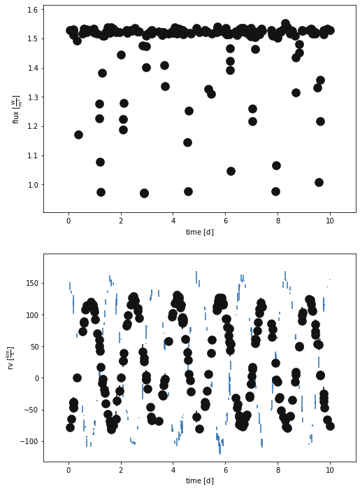
    


Let's evaluate the default binary just to see how bad it is


```python
b.set_value('pblum_mode', 'dataset-scaled')
b.run_compute(model='default')
_ = b.plot(x='times', show=True)
```

    100%|██████████| 200/200 [00:04<00:00, 41.34it/s]
    /usr/local/lib/python3.9/site-packages/phoebe/dependencies/autofig/call.py:1305: UserWarning: You passed a edgecolor/edgecolors ('none') for an unfilled marker ('+').  Matplotlib is ignoring the edgecolor in favor of the facecolor.  This behavior may change in the future.
      artist = ax.scatter(*datapoint,


    
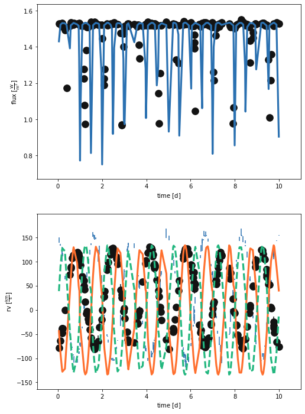
    


What a mess! Delete that model...


```python
b.remove_model('default')
```


    <ParameterSet: 10 parameters | contexts: figure, model>


Let's first try to fix the period.  We can start by looking at the RVs (PHOEBE's periodogram is built upon the astropy implementation of the LS periodogram)


```python
b.add_solver('estimator.rv_periodogram', solver='rvperiod')
print(b['rvperiod'])
```

    ParameterSet: 8 parameters
             comments@rvperiod@solver: 
           use_server@rvperiod@solver: none
            algorithm@rvperiod@solver: ls
          rv_datasets@rvperiod@solver: ['*']
            component@rvperiod@solver: binary
          sample_mode@rvperiod@solver: auto
       samples_per_peak@rvperiod@s...: 10
       nyquist_factor@rvperiod@solver: 5


Let's not touch the parameters for now, just to see what it comes up with


```python
b.run_solver('rvperiod', solution='rvperiod_solution')
print(b['rvperiod_solution'])
```

    ParameterSet: 10 parameters
    R  period@rvperiod_solution@so...: [ 0.40235315  0.41241198  0.42247081
     ... 40.01402079 40.02407961
     40.03413844] d
    R  power@rvperiod_solution@sol...: [0.562767   0.55478154 0.55243615 ...
     0.71461299 0.71365716 0.70937088]
       period_factor@rvperiod_solu...: 1.0
    R  fitted_twigs@rvperiod_solut...: ['period@binary@orbit@component']
    R  fitted_values@rvperiod_solu...: [0.6035297252658087]
    R  fitted_units@rvperiod_solut...: ['d']
       adopt_parameters@rvperiod_s...: ['period@binary@orbit@component']
       adopt_distributions@rvperio...: False
       adopt_values@rvperiod_solut...: True
       comments@rvperiod_solution@...: 


From looking directly at the data, that period looks a bit off.  Let's plot the periodogram itself


```python
plt.plot(b['period@rvperiod_solution'].value,b['power@rvperiod_solution'].value)
plt.xlabel('Period')
plt.ylabel('Power')
plt.xlim([0,5])
```


    (0.0, 5.0)


    
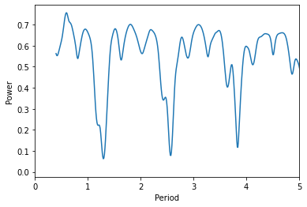
    


Ugly! But from our data, we can estimate that the period is roughly 1-2 days. So let's evaluate the periodogram only for this range


```python
b.set_value('sample_mode', context='solver', solver='rvperiod', value='manual')
b.set_value('sample_periods', context='solver', solver='rvperiod', value=np.linspace(1.,2.,200))
b.run_solver('rvperiod', solution='rvperiod_solution_2')
print(b['rvperiod_solution_2'])
```

    ParameterSet: 10 parameters
    R  period@rvperiod_solution_2@...: [2.         1.99497487 1.98994975 ...
     1.01005025 1.00502513 1.        ] d
    R  power@rvperiod_solution_2@s...: [0.61878495 0.62016585 0.62157344 ...
     0.67033284 0.66801086 0.66549368]
       period_factor@rvperiod_solu...: 1.0
    R  fitted_twigs@rvperiod_solut...: ['period@binary@orbit@component']
    R  fitted_values@rvperiod_solu...: [1.6683417085427137]
    R  fitted_units@rvperiod_solut...: ['d']
       adopt_parameters@rvperiod_s...: ['period@binary@orbit@component']
       adopt_distributions@rvperio...: False
       adopt_values@rvperiod_solut...: True
       comments@rvperiod_solution_...: 


This looks better.  It doesn't need to be exact as we can refine this with our fits later.


```python
b.adopt_solution('rvperiod_solution_2')
b.plot(x='phase', show=True)
```

    /usr/local/lib/python3.9/site-packages/phoebe/dependencies/autofig/call.py:1305: UserWarning: You passed a edgecolor/edgecolors ('none') for an unfilled marker ('+').  Matplotlib is ignoring the edgecolor in favor of the facecolor.  This behavior may change in the future.
      artist = ax.scatter(*datapoint,


    
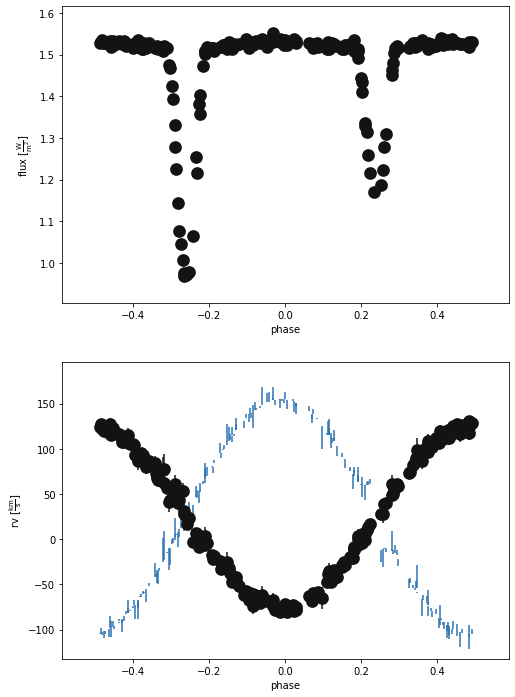
    


    (<autofig.figure.Figure | 2 axes | 3 call(s)>,
     <Figure size 576x864 with 2 Axes>)


Looks good!

Now we can start estimating parameters from the geometry of both the RV and light curves


```python
b.add_solver('estimator.rv_geometry', solver='rvgeom', overwrite=True)
b.run_solver('rvgeom', solution='rvgeom_solution')
```


    <ParameterSet: 17 parameters | components: primary, secondary>


For now, let's just blindly accept the results of the solver (in real life you'd probably want to inspect things, but we don't have time!)


```python
#rv_geometry solves for asini, which by default is constrained by sma, so we need to flip this in phoebe
b.flip_constraint('asini@binary', solve_for='sma@binary')
b.adopt_solution('rvgeom_solution')
b.run_compute(model='rvgeom_model')
b.plot(x='phase', legend=True, show=True)
```

    100%|██████████| 200/200 [00:17<00:00, 11.48it/s]
    /usr/local/lib/python3.9/site-packages/phoebe/dependencies/autofig/call.py:1305: UserWarning: You passed a edgecolor/edgecolors ('none') for an unfilled marker ('+').  Matplotlib is ignoring the edgecolor in favor of the facecolor.  This behavior may change in the future.
      artist = ax.scatter(*datapoint,


    
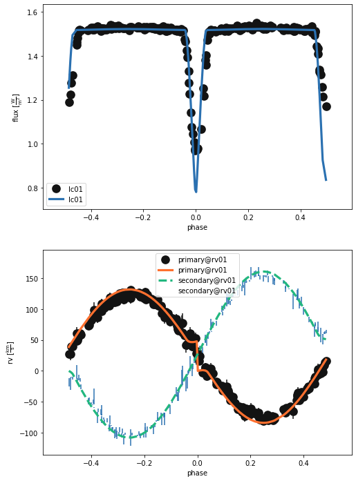
    


    (<autofig.figure.Figure | 2 axes | 6 call(s)>,
     <Figure size 576x864 with 2 Axes>)


As you might expect, letting the RV curve geometry set some parameters (t0, q, gamma, asini) makes the RV curve look good but doesn't do much for the LC (except tidy up the phasing). So, we need to use the light curve.  We could jump straight to using the lc_geometry but this doesn't fit for the inclination. So, let's try using phoebe's EBAI estimator first.


```python
b.add_solver('estimator.ebai', ebai_method='mlp', solver='ebai_mlp_est')
b.run_solver('ebai_mlp_est', solution='ebai_mlp_solution')
```


    <ParameterSet: 13 parameters | qualifiers: input_sigmas, adopt_values, ebai_fluxes, input_fluxes, fitted_values, fitted_twigs, input_phases, ebai_phases, adopt_distributions, comments, orbit, adopt_parameters, fitted_units>


```python
# flip constraints so we can adopt the solution
b.flip_constraint('esinw', solve_for='ecc')
b.flip_constraint('ecosw', solve_for='per0')
b.flip_constraint('requivratio', solve_for='requiv@secondary')
b.flip_constraint('requivsumfrac', solve_for='requiv@primary')
b.flip_constraint('teffratio', solve_for='teff@secondary')

# adopt solution and compute the model
b.adopt_solution('ebai_mlp_solution')
b.run_compute(model='ebai_mlp_model')
b.plot(x='phase', legend=True, show=True)
```

    100%|██████████| 200/200 [00:18<00:00, 10.82it/s]
    /usr/local/lib/python3.9/site-packages/phoebe/dependencies/autofig/call.py:1305: UserWarning: You passed a edgecolor/edgecolors ('none') for an unfilled marker ('+').  Matplotlib is ignoring the edgecolor in favor of the facecolor.  This behavior may change in the future.
      artist = ax.scatter(*datapoint,


    
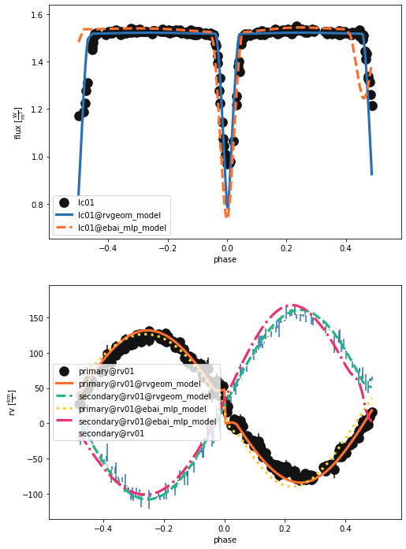
    


    (<autofig.figure.Figure | 2 axes | 9 call(s)>,
     <Figure size 576x864 with 2 Axes>)


Getting there! Now let's go with the lc_geometry estimator to finish our estimation of the system parameters.


```python
b.add_solver('estimator.lc_geometry', solver='lcgeom')
b.run_solver('lcgeom', solution='lcgeom_solution')
```


    <ParameterSet: 21 parameters | qualifiers: analytic_fluxes, analytic_best_model, input_fluxes, fitted_values, comments, adopt_values, adopt_distributions, secondary_phase, primary_width, analytic_phases, secondary_depth, primary_phase, eclipse_edges, primary_depth, fitted_twigs, orbit, input_sigmas, secondary_width, input_phases, adopt_parameters, fitted_units>


```python
# lc_geometry returns ecc and per0, so we need to flip the constraints back before adopting the solution
b.flip_constraint('ecc', solve_for='esinw')
b.flip_constraint('per0', solve_for='ecosw')

b.adopt_solution('lcgeom_solution')
b.run_compute(model='lcgeom_model')
b.plot(x='phase', legend=True, show=True)
```

    100%|██████████| 200/200 [00:18<00:00, 10.93it/s]
    /usr/local/lib/python3.9/site-packages/phoebe/dependencies/autofig/call.py:1305: UserWarning: You passed a edgecolor/edgecolors ('none') for an unfilled marker ('+').  Matplotlib is ignoring the edgecolor in favor of the facecolor.  This behavior may change in the future.
      artist = ax.scatter(*datapoint,


    
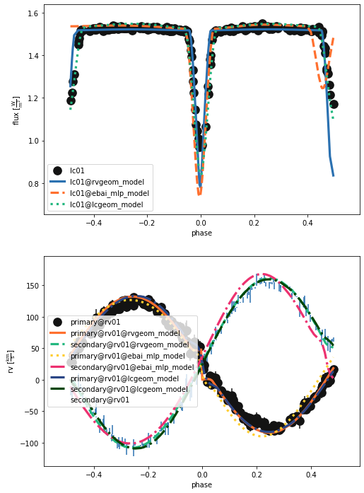
    


    (<autofig.figure.Figure | 2 axes | 12 call(s)>,
     <Figure size 576x864 with 2 Axes>)


```python
#Just plotting the most recent fit
b.plot(['dataset', 'lcgeom_model'], x='phase', show=True)

```

    /usr/local/lib/python3.9/site-packages/phoebe/dependencies/autofig/call.py:1305: UserWarning: You passed a edgecolor/edgecolors ('none') for an unfilled marker ('+').  Matplotlib is ignoring the edgecolor in favor of the facecolor.  This behavior may change in the future.
      artist = ax.scatter(*datapoint,


    
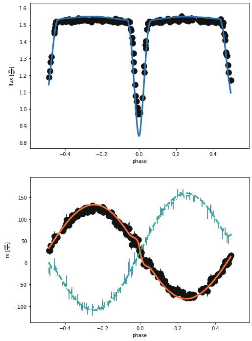
    


    (<autofig.figure.Figure | 2 axes | 6 call(s)>,
     <Figure size 576x864 with 2 Axes>)


Not terrible, but clearly not quite right. We've estimated, now let's optimise! We can use the Nelder-Mead method as it is incorporated into phoebe


```python
b.add_compute(
    compute='nm_fit',
    irrad_method='none',
    rv_method='dynamical',
    distortion_method='sphere'
) #This just changes a few compute parameters to speed up the solver

b.add_solver('optimizer.nelder_mead',  solver='nm_solver', compute='nm_fit')
b.set_value('maxiter', solver='nm_solver', value=20)

```

If we try to run the optimiser on all the data and for every parameter, this will take quite a long time. So, let's try to be clever and start with just the RV data and fit only to RV sensitive parameters.


```python
b.disable_dataset('lc01')
b['fit_parameters@nm_solver'] = ['vgamma@system', 't0_supconj@binary', 'q@binary', 'asini@binary']
b.run_solver('nm_solver', solution='nm_solution', overwrite=True)
```

    100%|██████████| 20/20 [00:48<00:00,  2.40s/it]


    <ParameterSet: 11 parameters | qualifiers: success, adopt_values, niter, fitted_units, fitted_values, initial_values, fitted_twigs, message, comments, adopt_parameters, adopt_distributions>


Let's adopt that solution so we can run_compute and check it visually.


```python
b.adopt_solution('nm_solution')
b.run_compute('nm_fit', solution='nm_solution', model='after_nm', overwrite=True)

b.plot(kind='rv', model='after_nm', x='phases', show=True, legend=True, marker = 'o')
b.plot( kind='rv', model='after_nm', x='phases', y='residuals', show=True, legend=True, marker = 'o')

```

    Wed, 14 Sep 2022 09:18 BUNDLE       WARNING applying passed solution (nm_solution) to sample_from
    Wed, 14 Sep 2022 09:18 BUNDLE       WARNING defaulting sample_num=1 since adopt_distributions@nm_solution=False
    Wed, 14 Sep 2022 09:18 BACKENDS     WARNING only one sample, falling back on sample_mode='all', sample_num=1 instead of sample_mode='1-sigma', sample_num=1
    100%|██████████| 1/1 [00:00<00:00,  1.12it/s]


    
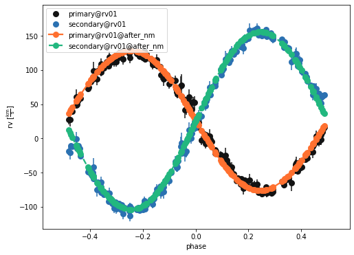
    


    
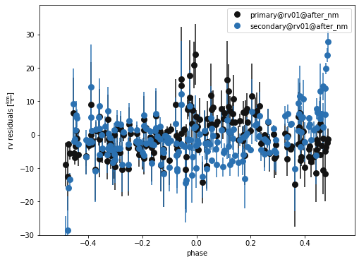
    


    (<autofig.figure.Figure | 1 axes | 2 call(s)>,
     <Figure size 576x432 with 1 Axes>)


Ok, now let's go back to the LC


```python
b.disable_dataset('rv01')
b.enable_dataset('lc01')
```


    <ParameterSet: 18 parameters | components: primary, secondary, binary>


Running the optimiser for *all* data is expensive, so we can fit just to the eclipse regions.  The simplest way to do this is to mask the data using our previous lc_geometry solution


```python
b.set_value(solution = 'lcgeom_solution', qualifier='adopt_parameters', value=['mask_phases'])
b.adopt_solution('lcgeom_solution')
b.plot(kind='lc', model='lcgeom_model', x='phases', show='True')
```


    
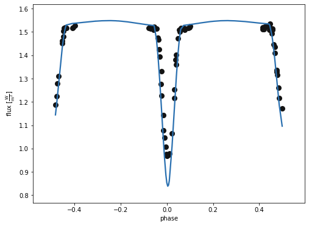
    


    (<autofig.figure.Figure | 1 axes | 2 call(s)>,
     <Figure size 576x432 with 1 Axes>)


Previously we fit for the fractional sum of radii but we can now go back to having R1 and R2 as independent parameters.  Similarly we need to define the parameters to fit for.


```python
b.flip_constraint('requiv@primary', solve_for='requivsumfrac@binary') 

b['fit_parameters'] = ['teffratio@binary','t0_supconj@binary','incl@binary']
```


```python
b.run_solver('nm_solver', solution='nm_solution', overwrite=True)

```

    Wed, 14 Sep 2022 09:18 BUNDLE       WARNING fit_parameters contains a parameter (['t0_supconj']) that affects phasing which could cause issues with mask_phases
    100%|██████████| 20/20 [04:27<00:00, 13.37s/it]


    <ParameterSet: 11 parameters | qualifiers: success, adopt_values, niter, fitted_units, fitted_values, initial_values, fitted_twigs, message, comments, adopt_parameters, adopt_distributions>


```python
b.adopt_solution('nm_solution')
b.run_compute('nm_fit', solution='nm_solution', model='after_nmlc')
b['mask_enabled@lc01']=False #Turn of the phase masking for plotting
b.plot(kind='lc', model='after_nmlc', x='phases', show=True, legend=True, marker = 'o')
b.plot(kind='lc', model='after_nmlc', x='phases', y='residuals', show=True, legend=True, marker = 'o')
```

    Wed, 14 Sep 2022 09:23 BUNDLE       WARNING applying passed solution (nm_solution) to sample_from
    Wed, 14 Sep 2022 09:23 BUNDLE       WARNING defaulting sample_num=1 since adopt_distributions@nm_solution=False
    Wed, 14 Sep 2022 09:23 BACKENDS     WARNING only one sample, falling back on sample_mode='all', sample_num=1 instead of sample_mode='1-sigma', sample_num=1
    100%|██████████| 1/1 [00:04<00:00,  4.82s/it]


    
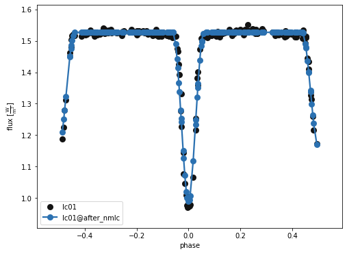
    


    
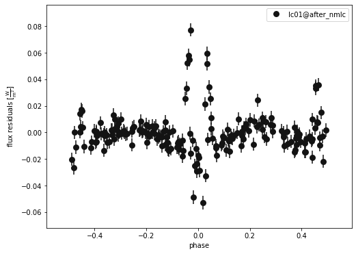
    


    (<autofig.figure.Figure | 1 axes | 1 call(s)>,
     <Figure size 576x432 with 1 Axes>)


A closer look at the primary eclipse...


```python
b.plot(kind='lc', x='phases', model='after_nmlc', xlim=[-0.2,0.2], show=True, legend=True, marker = 'o')
b.plot(kind='lc', x='phases', model='after_nmlc', xlim=[-0.2,0.2], y='residuals', show=True, legend=True, marker = 'o')
```


    

    


    
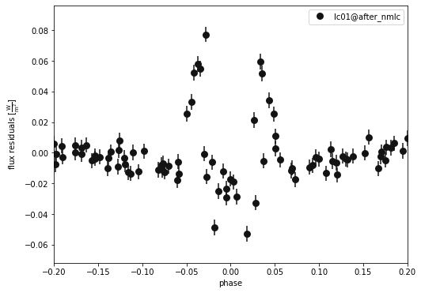
    


    (<autofig.figure.Figure | 1 axes | 1 call(s)>,
     <Figure size 576x432 with 1 Axes>)


Not awful, but we could improve by fitting everything together.  This will be expensive so we will only do this if we have time!


```python
b.enable_dataset('rv01') #Enable the RV dataset
b['mask_enabled@lc01']=True #Turn on the phase masking again
```

Can fit for whatever we like, but often better to fit for a only a handful of parameters.


```python
b['fit_parameters'].choices
```


    ['distance@system',
     'vgamma@system',
     'ebv@system',
     'Av@system',
     'Rv@system',
     'requiv@primary@star@component',
     'requiv_max@primary@star@component',
     'requiv_min@primary@star@component',
     'teff@primary@star@component',
     'abun@primary@star@component',
     'logg@primary@star@component',
     'syncpar@primary@star@component',
     'period@primary@star@component',
     'freq@primary@star@component',
     'pitch@primary@star@component',
     'yaw@primary@star@component',
     'incl@primary@star@component',
     'long_an@primary@star@component',
     'gravb_bol@primary@star@component',
     'irrad_frac_refl_bol@primary@star@component',
     'irrad_frac_lost_bol@primary@star@component',
     'ld_coeffs_bol[0]@primary@star@component',
     'ld_coeffs_bol[1]@primary@star@component',
     'mass@primary@star@component',
     'requiv@secondary@star@component',
     'requiv_max@secondary@star@component',
     'requiv_min@secondary@star@component',
     'teff@secondary@star@component',
     'abun@secondary@star@component',
     'logg@secondary@star@component',
     'syncpar@secondary@star@component',
     'period@secondary@star@component',
     'freq@secondary@star@component',
     'pitch@secondary@star@component',
     'yaw@secondary@star@component',
     'incl@secondary@star@component',
     'long_an@secondary@star@component',
     'gravb_bol@secondary@star@component',
     'irrad_frac_refl_bol@secondary@star@component',
     'irrad_frac_lost_bol@secondary@star@component',
     'ld_coeffs_bol[0]@secondary@star@component',
     'ld_coeffs_bol[1]@secondary@star@component',
     'mass@secondary@star@component',
     'period@binary@orbit@component',
     'period_anom@binary@orbit@component',
     'freq@binary@orbit@component',
     'dpdt@binary@orbit@component',
     'per0@binary@orbit@component',
     'dperdt@binary@orbit@component',
     'ecc@binary@orbit@component',
     't0_perpass@binary@orbit@component',
     't0_supconj@binary@orbit@component',
     't0_ref@binary@orbit@component',
     'mean_anom@binary@orbit@component',
     'incl@binary@orbit@component',
     'q@binary@orbit@component',
     'sma@binary@orbit@component',
     'long_an@binary@orbit@component',
     'asini@binary@orbit@component',
     'ecosw@binary@orbit@component',
     'esinw@binary@orbit@component',
     'teffratio@binary@orbit@component',
     'requivratio@binary@orbit@component',
     'requivsumfrac@binary@orbit@component',
     'sma@primary@star@component',
     'asini@primary@star@component',
     'sma@secondary@star@component',
     'asini@secondary@star@component',
     'mask_phases[0]@binary@lc01@lc@dataset',
     'mask_phases[1]@binary@lc01@lc@dataset',
     'sigmas_lnf@lc01@lc@dataset',
     'pbflux@lc01@lc@dataset',
     'l3@lc01@lc@dataset',
     'l3_frac@lc01@lc@dataset',
     'exptime@lc01@lc@dataset',
     'ld_coeffs[0]@primary@lc01@lc@dataset',
     'ld_coeffs[1]@primary@lc01@lc@dataset',
     'ld_coeffs[0]@secondary@lc01@lc@dataset',
     'ld_coeffs[1]@secondary@lc01@lc@dataset',
     'pblum@primary@lc01@lc@dataset',
     'pblum@secondary@lc01@lc@dataset',
     'sigmas_lnf@primary@rv01@rv@dataset',
     'sigmas_lnf@secondary@rv01@rv@dataset',
     'rv_offset@primary@rv01@rv@dataset',
     'rv_offset@secondary@rv01@rv@dataset',
     'ld_coeffs[0]@primary@rv01@rv@dataset',
     'ld_coeffs[1]@primary@rv01@rv@dataset',
     'ld_coeffs[0]@secondary@rv01@rv@dataset',
     'ld_coeffs[1]@secondary@rv01@rv@dataset']


```python
b['fit_parameters'] = ['t0_supconj@binary','teffratio@binary','requiv@primary','requivratio@binary','ecc@binary','per0@binary']
```


```python
b.run_solver('nm_solver', solution='nm_solution', overwrite=True)

```

    Wed, 14 Sep 2022 09:24 BUNDLE       WARNING fit_parameters contains a parameter (['t0_supconj', 'per0']) that affects phasing which could cause issues with mask_phases
    100%|██████████| 20/20 [04:58<00:00, 14.90s/it]


    <ParameterSet: 11 parameters | qualifiers: success, adopt_values, niter, fitted_units, fitted_values, initial_values, fitted_twigs, message, comments, adopt_parameters, adopt_distributions>


```python
b.run_compute('nm_fit', solution='nm_solution', model='after_nmrvlc',overwrite=True)
b['mask_enabled@lc01']=False #Turn of the phase masking for plotting
b.plot(kind='lc', model='after_nmrvlc', x='phases', show=True, legend=True, marker = 'o')
b.plot(kind='lc', model='after_nmrvlc', x='phases', y='residuals', show=True, legend=True, marker = 'o')
```

    Wed, 14 Sep 2022 09:29 BUNDLE       WARNING applying passed solution (nm_solution) to sample_from
    Wed, 14 Sep 2022 09:29 BUNDLE       WARNING defaulting sample_num=1 since adopt_distributions@nm_solution=False
    Wed, 14 Sep 2022 09:29 BACKENDS     WARNING only one sample, falling back on sample_mode='all', sample_num=1 instead of sample_mode='1-sigma', sample_num=1
    100%|██████████| 1/1 [00:08<00:00,  8.62s/it]


    
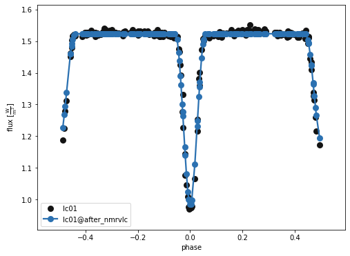
    


    
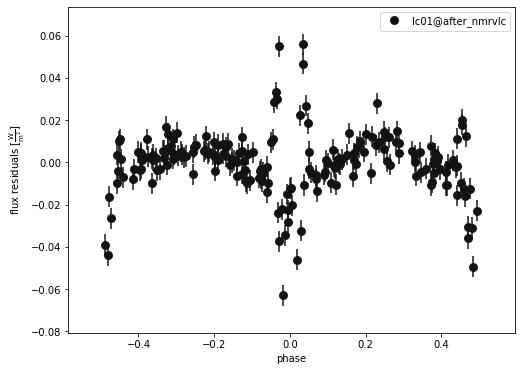
    


    (<autofig.figure.Figure | 1 axes | 1 call(s)>,
     <Figure size 576x432 with 1 Axes>)


```python
b.plot(kind='lc', x='phases', model='after_nmrvlc', xlim=[-0.2,0.2], show=True, legend=True, marker = 'o')
b.plot(kind='lc', x='phases', model='after_nmrvlc', xlim=[-0.2,0.2], y='residuals', show=True, legend=True, marker = 'o')
```


    
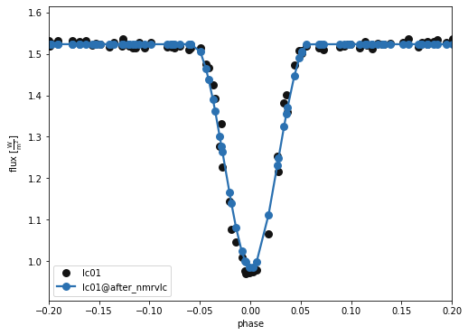
    


    
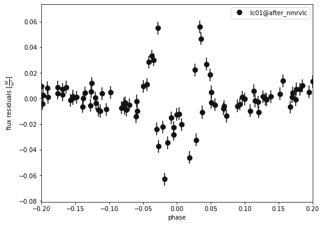
    


    (<autofig.figure.Figure | 1 axes | 1 call(s)>,
     <Figure size 576x432 with 1 Axes>)


Can compare these new parameters to the old ones:


```python
#Trial run allows us to see the fit parameters without adopting them
print(b.adopt_solution('nm_solution',trial_run=True)) 
```

    ParameterSet: 6 parameters
       t0_supconj@binary@orbit@com...: 1.23455809771073 d
       teffratio@binary@orbit@comp...: 0.9092681906886235
        requiv@primary@star@component: 1.4044329147588968 solRad
       requivratio@binary@orbit@co...: 1.030635708218095
           ecc@binary@orbit@component: 0.014705721991321426
          per0@binary@orbit@component: 91.01708603404344 deg


```python
b['teffratio']
```


    <Parameter: teffratio=0.9235518744809998 | keys: description, value, quantity, default_unit, limits, visible_if, copy_for, readonly, advanced, latexfmt>


Once you are happy that your fit is optimal, you should really sample around the solution using e.g. MCMC to probe the posterior distributions.  This is *VERY* computationally expensive, so we won't be able to do that here.  If you are interested, please join the next PHOEBE workshop! http://phoebe-project.org/workshops
