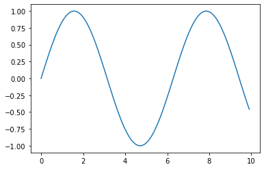

# Test

## This page is a test page

[Download link for this notebook](test.ipynb)


```python
import numpy as np
import matplotlib.pyplot as plt
```


```python
x=np.arange(0,10,0.1)
y=np.sin(x)
```


```python
plt.plot(x,y)
```


    [<matplotlib.lines.Line2D at 0x119a603d0>]


    

    


```python

```
